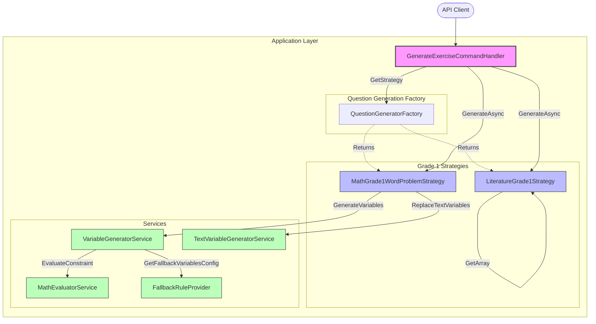

# Khái quát kiến trúc hệ thống (YourExam_Backend)

Tài liệu này được sinh tự động dựa trên phân tích từ **GitNexus**. Nó mô tả các module chính, các luồng thực thi quan trọng và sơ đồ kiến trúc tổng quan của dự án.

## 1. Tổng quan dự án (Codebase Stats)
- **Tên dự án**: YourExam_Backend
- **Số lượng File**: 102
- **Số lượng Symbol**: 817
- **Số lượng Luồng thực thi (Processes)**: 24

## 2. Các khu vực chức năng chính (Functional Areas)
Hệ thống được tổ chức thành các Cụm chức năng (Clusters) có tính liên kết cao:

| Tên Module | Số lượng Symbol | Độ gắn kết (Cohesion) | Vai trò chính |
|---|---|---|---|
| **Services** | 20 | 91% | Chứa các dịch vụ nghiệp vụ cốt lõi (Variable Generator, Math Evaluator, v.v...) |
| **Grade1** | 19 | 95% | Các chiến lược sinh đề thi chuyên biệt cho học sinh Lớp 1 (Toán, Tiếng Việt) |
| **Interfaces** | 17 | 82% | Định nghĩa các hợp đồng (Contracts) cho Dependency Injection và Clean Architecture |
| **QuestionGeneration** | 12 | 76% | Factory và các lớp cơ sở để điều phối việc sinh câu hỏi |

## 3. Các luồng thực thi quan trọng (Key Execution Flows)
Dưới đây là 5 luồng nghiệp vụ quan trọng nhất (Top 5 Processes), thể hiện cách các thành phần gọi lẫn nhau trong quá trình sinh đề thi:

1. **Luồng áp dụng cấu hình dự phòng (Handle → GetFallbackVariablesConfig)**
   - `GenerateExerciseCommandHandler` (Bắt đầu xử lý Request)
   - `MathGrade1WordProblemStrategy` (Chiến lược giải toán có lời văn Lớp 1)
   - `VariableGeneratorService` (Sinh các biến số ngẫu nhiên)
   - `IFallbackRuleProvider` (Lấy cấu hình biến dự phòng nếu cấu hình chính lỗi)

2. **Luồng đánh giá điều kiện toán học (Handle → EvaluateConstraint)**
   - `GenerateExerciseCommandHandler`
   - `MathGrade1WordProblemStrategy`
   - `VariableGeneratorService`
   - `IMathEvaluatorService` (Đánh giá các điều kiện, ví dụ: $x + y < 100$)

3. **Luồng sinh biến số (Handle → GenerateVariables)**
   - `GenerateExerciseCommandHandler`
   - `MathGrade1WordProblemStrategy`
   - `IVariableGeneratorService`

4. **Luồng thay thế biến văn bản (Handle → ReplaceTextVariables)**
   - `GenerateExerciseCommandHandler`
   - `MathGrade1WordProblemStrategy`
   - `ITextVariableGeneratorService` (Điền các biến số vào trong chuỗi văn bản của câu hỏi)

5. **Luồng xử lý nội bộ Tiếng Việt (GenerateAsync → GetArray)**
   - `LiteratureGrade1Strategy.GenerateAsync`
   - `LiteratureGrade1Strategy.GeneratePhonetics` (Sinh câu hỏi ngữ âm)
   - `LiteratureGrade1Strategy.GetArray` (Truy xuất từ điển Tiếng Việt)

## 4. Sơ đồ Kiến trúc (Architecture Diagram)

Sơ đồ dưới đây minh họa sự liên kết giữa các Module chính khi thực thi luồng **Sinh Bài Tập (Generate Exercise)**:

